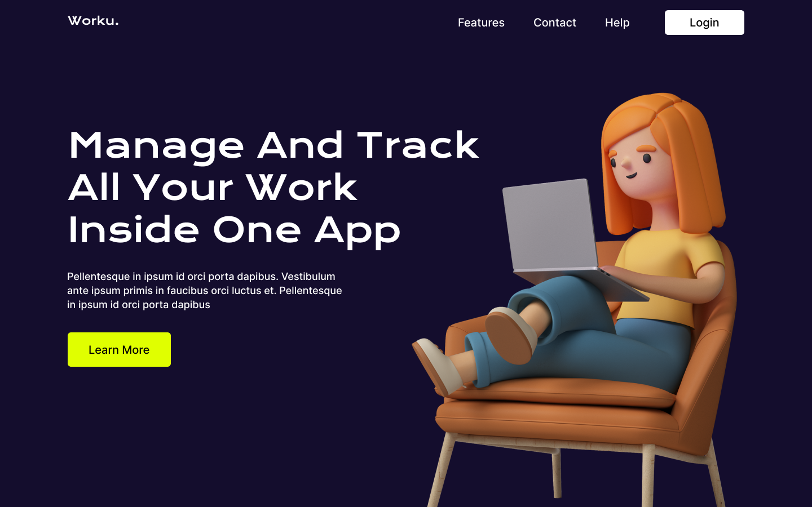

# Worku. - Landing Page UI solution.

This is a solution to the [Worku. - Landing Page UI](https://www.figma.com/community/file/1119570033612610010).

## Table of contents

- [Overview](#overview)
  - [Screenshot](#screenshot)
  - [Links](#links)
  - [Built with](#built-with)
  - [Author](#author)

## Overview

The challenge is to build out this landing page and get it looking as close to the design as possible.

### Screenshot

### Links

- Live Site URL: [live site](https://tourmaline-palmier-375fb3.netlify.app/)

### Built with

- React
- [SweetAlert2]()
- [REACT-SPINNERS](https://www.davidhu.io/react-spinners/)
- [React-Icons](https://react-icons.github.io/react-icons/)
- [Animate.css](https://animate.style/)
- [React Router](https://reactrouter.com/)
- lazy loading
- Suspense
- sass
- Flexbox

## Author

- builded by - [@mohamed-benoughidene](https://github.com/mohamed-benoughidene)
